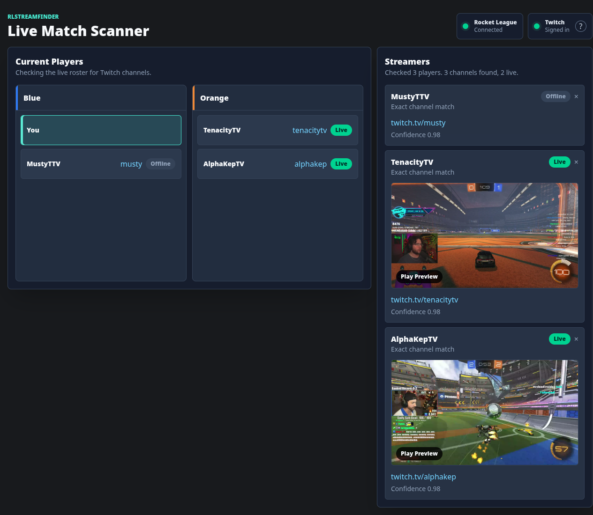
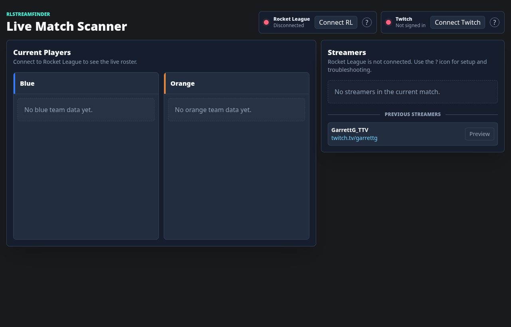
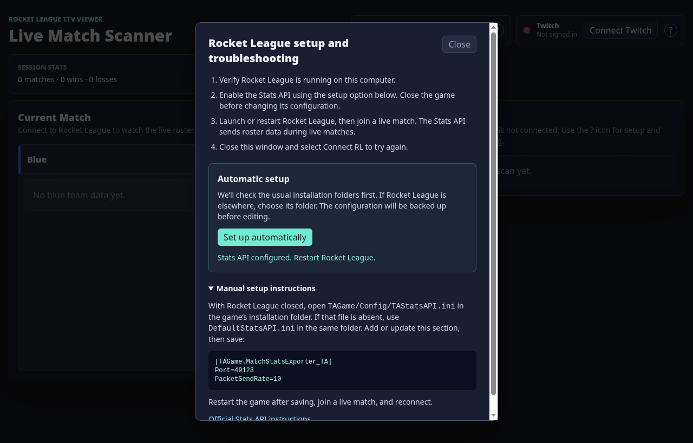
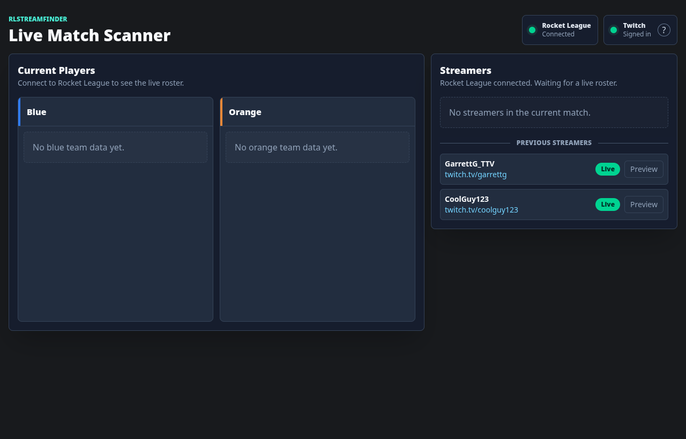

# RLStreamFinder

RLStreamFinder helps you spot potential Twitch streamers in your live Rocket League match:

- **Live match roster:** Reads Rocket League's Stats API and shows both teams.
- **Automatic Twitch lookups:** Checks player names from the live roster for exact Twitch channel matches. Names with a `TTV`, `TV`, or `Twitch` marker are also checked with that marker removed.
- **Stream details:** Shows matched channels, live or offline status, Twitch links, and stream previews when available.
- **Streamer history:** Keeps previously found streamers available after they leave the roster.



## Install and run

Rocket League and this app must run on the same computer. Live roster capture supports Windows and Linux installations using Wine or Proton. You also need a Twitch account to check channels and live status; sign-in happens on Twitch's site.

Download the latest build from the [Releases page](https://github.com/EMcCormack/RLStreamFinder/releases). The first release, [v0.1.0 Preview](https://github.com/EMcCormack/RLStreamFinder/releases/tag/v0.1.0), provides:

- **Windows:** Download `RLStreamFinder-0.1.0.Setup.exe`, run the installer, then open **RLStreamFinder** from the Start menu. The installer is currently unsigned, so Windows may show a security warning.
- **Linux (x64):** Download `RLStreamFinder-linux-x64-0.1.0.zip`, extract it, then run `rl-stream-finder` from the extracted folder.

No Node.js or pnpm installation is needed for these downloads. The release also includes `SHA256SUMS` if you want to verify the downloaded files.

### Run from source

Install [Node.js 24](https://nodejs.org/), then install the project’s pnpm version and run:

```bash
npm install --global pnpm@11.3.0
git clone https://github.com/EMcCormack/RLStreamFinder.git
cd RLStreamFinder
pnpm install --frozen-lockfile
pnpm start
```

To create a local packaged app instead, run `pnpm package` and open the app in `out/RLStreamFinder-<platform>-<arch>/`.

## First-time setup

1. **Configure Rocket League.** Close the game, click the **?** beside **Connect RL**, then choose **Set up automatically**. The app checks common installation folders first and asks you to choose the Rocket League folder if needed. It backs up the Stats API configuration before changing it.
2. **Connect Rocket League.** Restart the game, join a live match, and click **Connect RL**. The roster only appears while Rocket League is sending live match data.
3. **Connect Twitch.** Click **Connect Twitch** and enter the displayed code on the Twitch page opened in your browser. The app does not ask for your Twitch password or extra permissions. Click the Twitch **?** for an explanation in the app.



### Rocket League setup screen



If automatic setup cannot find the configuration, the dialog includes manual steps. With Rocket League closed, edit `TAGame/Config/TAStatsAPI.ini` in its installation folder, or `DefaultStatsAPI.ini` if that file is absent. The exporter section needs these values:

```ini
[TAGame.MatchStatsExporter_TA]
Port=49123
PacketSendRate=10
```

Save the file, restart Rocket League, and join a live match. See the [official Stats API instructions](https://www.rocketleague.com/developer/stats-api) for more detail.

## How Twitch matching works

In the example screenshot, `MustyTTV` appears on Blue with you, while `TenacityTV` and `AlphaKepTV` appear on Orange. The scenario and online status are fixed test data. The stream images are real, archived Twitch clip frames; the app checks Twitch for current status during normal use.

In a real match, select **Play Preview** when a live channel is found, or open the channel on Twitch. A name match is a suggestion, so check the channel before assuming it belongs to the player. The streamer card stays visible while that player is on the game board. When the roster clears or the player leaves, the entry moves below **Previous Streamers** so you can find the channel again. Its last checked Live or Offline status remains visible there for five minutes.



## Regenerate the demo screenshot

Run `pnpm screenshots:demo` after a UI change. This packages the app, loads the fixed 2v2 fixture, waits for both pinned preview frames, and updates `docs/screenshots/live-match-demo.png`. It does not require Rocket League or Twitch sign-in. The image sources and capture context are in [test/e2e/fixtures/stream-previews/README.md](test/e2e/fixtures/stream-previews/README.md).

## Troubleshooting

- **Rocket League stays disconnected:** Make sure the game is running on the same computer. Use the Rocket League **?** to check setup, restart the game after changing its configuration, and enter a live match.
- **No players appear:** The Stats API sends rosters during live matches; replays and menus do not supply a live roster.
- **Twitch is not signed in:** Select **Connect Twitch** again and finish the code step on Twitch's site.
- **No streamer is found:** Rocket League names and Twitch names may differ. The app only shows likely matches and cannot identify every stream.

The saved Twitch sign-in and previous streamer links are stored on this computer. Channel checks send possible Twitch names to Twitch.

For development details, see [ARCHITECTURE.md](ARCHITECTURE.md). For release builds, see [docs/RELEASING.md](docs/RELEASING.md). Run `pnpm typecheck` and `pnpm test` after changing the app.
